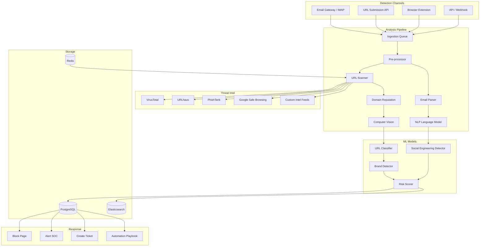

<p align="center">
  
  
  
  
  
  
  
</p>

<p align="center">
  <b>AI Phishing Detection</b><br/>
  URL scanner, email analysis, domain reputation, brand impersonation detection, and cross-browser extension.
</p>

---

## 📋 Description

**Kirov Phishing Detection Engine** is an AI-powered anti-phishing platform that protects organizations and individuals from phishing attacks across email, web, and messaging channels. It combines machine learning-based URL classification, email header and content analysis, domain reputation scoring, brand impersonation detection, and real-time browser protection via Chrome and Firefox extensions.

The engine processes millions of URLs and emails daily, using a multi-layered detection pipeline: heuristic analysis, computer vision models for brand logo recognition, NLP models for social engineering language detection, and graph-based reputation networks for domain trust assessment. Every detection is enriched with threat intelligence and fed into the Kirov ecosystem for automated response.

---

## 🏗️ Architecture



---

## ✨ Key Features

- **🔗 URL Analysis** — Real-time URL classification using ML models trained on 10M+ phishing and benign URLs
- **📧 Email Analysis** — Deep email header analysis (SPF, DKIM, DMARC), body text NLP, and attachment scanning
- **🌐 Domain Reputation** — WHOIS analysis (age, registrar), domain similarity scoring (typosquatting, homograph attacks), and SSL certificate validation
- **🏷️ Brand Impersonation Detection** — Computer vision models that detect forged login pages for 500+ brands (banks, SaaS, social media)
- **🧠 AI Social Engineering Detection** — NLP model detects urgency language, credential requests, invoice fraud, and CEO fraud patterns
- **🛡️ Browser Extensions** — Chrome and Firefox extensions with real-time URL checking and visual warning overlays
- **📊 Phishing Campaign Tracking** — Groups related phishing URLs, emails, and domains into campaigns with attributed threat actors
- **⚡ Real-Time Blocking** — Sub-100ms scanning for browser extension; sub-5s for full email analysis pipeline
- **🔍 Threat Intel Enrichment** — Multi-source enrichment from VirusTotal, URLhaus, PhishTank, Google Safe Browsing, and OpenPhish
- **📈 Analytics Dashboard** — Phishing trends, top targeted brands, geographic attack heatmaps, and employee susceptibility metrics

---

## 🛠️ Tech Stack

| Category | Technology |
|----------|-----------|
| **Backend** | FastAPI 0.110+ (Python 3.11+) |
| **ML Framework** | PyTorch, Hugging Face Transformers, ONNX Runtime |
| **CV Models** | YOLOv8, ResNet (brand logo detection) |
| **NLP Models** | BERT-based social engineering detector (fine-tuned) |
| **URL Classifier** | XGBoost + Deep learning ensemble |
| **Browser Extension** | Chrome (Manifest V3), Firefox (Manifest V3) |
| **Database** | PostgreSQL 16 |
| **Cache** | Redis 7 |
| **Search** | Elasticsearch 8 |
| **Message Queue** | RabbitMQ |
| **Containerization** | Docker, Docker Compose |
| **Threat Intel APIs** | VirusTotal, Google Safe Browsing, URLhaus |

---

## 🚀 Quick Start

### Prerequisites

- Python 3.11+, Docker and Docker Compose
- Node.js 18+ (for browser extension development)
- ML model weights (download from releases)

### Installation

```bash
# Clone the repository
git clone https://github.com/Raphasha27/kirov-phishing-detection-engine.git
cd kirov-phishing-detection-engine

# Download pre-trained ML models
mkdir -p server/app/ml-models
# Download models from https://github.com/Raphasha27/kirov-phishing-detection-engine/releases

# Copy environment configuration
cp .env.example .env
# Edit .env with your API keys

# Start with Docker Compose
docker compose up -d

# Or run the server locally:
cd server
python -m venv venv
source venv/bin/activate  # Windows: venv\Scripts\activate
pip install -r requirements.txt
uvicorn app.main:app --reload --port 8000
```

### Load Browser Extension

1. Open Chrome/Firefox and navigate to `chrome://extensions` / `about:debugging#/runtime/this-firefox`
2. Enable Developer Mode
3. Click "Load Unpacked" and select `extension/chrome` or `extension/firefox`
4. Configure the extension settings to point to your server URL

### Scan a URL

```bash
# Quick URL scan
curl -X POST http://localhost:8000/api/v1/scan/url \
  -H "Content-Type: application/json" \
  -d '{"url": "https://suspicious-login-page.com/verify"}'

# Analyze an email (raw .eml file)
curl -X POST http://localhost:8000/api/v1/scan/email \
  -F "file=@phishing.eml"
```

---

## 📡 API Overview

| Endpoint | Method | Description |
|----------|--------|-------------|
| `/api/v1/health` | GET | Health check |
| `/api/v1/scan/url` | POST | Scan single URL |
| `/api/v1/scan/email` | POST | Analyze email (.eml/.msg) |
| `/api/v1/scan/batch` | POST | Batch URL scan (up to 100) |
| `/api/v1/domain/:domain/reputation` | GET | Domain reputation report |
| `/api/v1/domain/:domain/whois` | GET | WHOIS lookup |
| `/api/v1/brands` | GET | List monitored brands |
| `/api/v1/brands/:id/detections` | GET | Brand impersonation detections |
| `/api/v1/campaigns` | GET | List phishing campaigns |
| `/api/v1/campaigns/:id` | GET | Campaign details |
| `/api/v1/threat-intel/lookup` | POST | Threat intel enrichment lookup |

---

## 🔗 Integration with Kirov Ecosystem

| Component | Integration |
|-----------|-------------|
| **[Security Dashboard](https://github.com/Raphasha27/kirov-security-dashboard)** | Phishing campaign metrics and real-time detection dashboard |
| **[Cyber Automation Engine](https://github.com/Raphasha27/kirov-cyber-automation-engine)** | Auto-block phishing domains, notify users, reset compromised credentials |
| **[Threat Hunter](https://github.com/Raphasha27/kirov-threat-hunter)** | Feeds phishing IOCs (URLs, domains, sender addresses) for threat hunting |
| **[Malware Analysis Lab](https://github.com/Raphasha27/kirov-malware-analysis-lab)** | Analyzes phishing email attachments for malware |
| **[AI Security Assistant](https://github.com/Raphasha27/kirov-ai-security-assistant)** | Scans phishing kit source code for vulnerabilities |

---

## 🔒 Security Considerations

- **Model Adversarial Robustness**: ML models are regularly tested against adversarial attacks (gradient-based evasion, character substitution). Ensemble models reduce single-model vulnerability.
- **URL Safety**: The scanner never visits or renders URLs. All analysis is performed on URL strings, DNS data, and cached page screenshots.
- **Email Privacy**: Email analysis is performed in-memory; raw email content is not stored by default (configurable retention)
- **Browser Extension Permissions**: Minimal permissions — only `webNavigation`, `tabs`, and `storage`; no access to browsing history or credentials
- **False Positive Management**: Built-in feedback loop for users to report incorrect classifications; daily model retraining
- **Data Residency**: All scanning data stays within your deployment; no external PII leakage

---

## 🗺️ Roadmap

- [ ] **Q3 2026** — QR code phishing (quishing) detection with computer vision
- [ ] **Q3 2026** — SMS phishing (smishing) analysis with carrier API integration
- [ ] **Q4 2026** — Voice phishing (vishing) detection via call metadata analysis
- [ ] **Q4 2026** — AI-generated phishing detection (deepfake voice, ChatGPT-generated emails)
- [ ] **Q1 2027** — Real-time DMARC monitoring and email authentication reporting
- [ ] **Q1 2027** — Phishing simulation platform for employee security awareness training
- [ ] **Q2 2027** — Browser extension with visual phishing indicator and safe browsing mode

---

## 📄 License

This project is licensed under the **MIT License** — see the [LICENSE](LICENSE) file for details.

## 🙏 Attribution

Created and maintained by **Kirov Security Labs** — the research and development division of Kirov, dedicated to advancing AI-driven cybersecurity solutions.

<p align="center">
  <sub>Don't take the bait. Detect phishing before it detects you.</sub>
</p>
